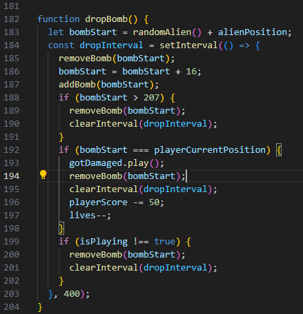
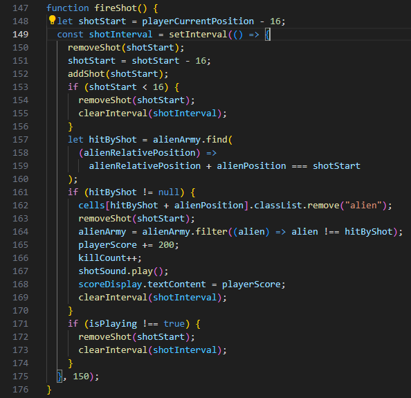
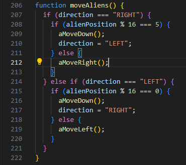

# General Assembly

Raging Tauros is a game with the space invaders template. You must stop an approaching herd of Tauros by capturing them with pokeballs.
The herd will move towards one side of the screen in unison, then when they reach the side, will take once pace forward and then move to the other side, repeating until they reach your position at the bottom of the screen. If the herd of Tauros reaches the player, it is Game Over!
Periodically, a random Tauros will shoot a concentrated blast of pure rage at you, the player will lose one life if this connects with the player.
If a player loses all of their lives, it is Game Over!

## Game's Link

Raging Tauros (https://mbroadbent95.github.io/SEB-Project-1/)

## Overview and concept

I was tasked to build my own version of Space Invaders game from scratch using HTML, CSS & JavaScript.
My spin was using the Retro Pokemon aesthetic from the 90’s, featuring the bull Pokemon Tauros in place of the aliens.

## Technologies Used

### HTML

- Head containing game title, links to styleSheet, favicon icon, and JavaScript link.
- Body includes grid for gameplay. Additionally, you will find the lives and score display. At the bottom of the page/ HTML you will find 3 buttons, start, reset, & mute. Control instructions follow beneath these buttons.

### CSS

- Flexbox to guide the structure of my JavaScript grid.
- Various styling tags disseminated via class & ID for precision styling.
- Images and colours to convey key themes, tone and and feel of the page.
- image classes to be added and removed from cells upon function. This is to display the player character, the Tauros(aliens) and their respective projectiles.

### JavaScript

- new Audio to import my sounds from my relative sounds folder. new Audio inludes sound effects for various actions you can take in the game as well as background music.
- setInterval to time specific events and functions and create a dynamic experience.
- playerScore system to track and accumulate points, then to be stored on your browser's local starage.
- arrayMethods to quickly draw up a herd of Tauros, then manipulate them as instructed.
- create grid for loop, this created a dynamic grid which could be created and adjusted as necessary.
- classList functions, adding and removing classes to cells in order to manipulate player and Tauros movement.
- mute button function to allow players to turn off/ on the background audio respectively.
- Keydown events to allow player control of their avatar.
- setTimeout to alert the player of their score once the game finishes.

### Project Brief;

Space Invaders is a classic arcade game from the 80s. The player aims to shoot an invading alien armada, before it reaches the planet's surface using a mounted gun turret.

The player can only move left or right. The aliens also move from left to right, and also down each time they reach the side of the screen. The aliens also periodically drop bombs towards the player.

Once the player has destroyed a wave of aliens, the game starts again. The aim is to achieve the highest score possible before either being destroyed by the aliens, or allowing them to reach the planet's surface.

Requirements
The player should be able to clear at least one wave of aliens.
The player's score should be displayed at the end of the game.

Challenges
The main challenge here is the movement of large groups of aliens in formation, and the animation of the bombs and player's shots. There are several approaches here, with collision detection being the more challenging.

## The Approach Taken

- Throughout my project journey i kept a small diary of my plans, progress and blocks. We were assigned out projects on Thursday 15-02-24 to start on the following day and finish for the next Friday. This will be a brief overview.
- Day 1 Friday -
- Project planning and establishment of basic boilerplate. I had a rough roadmap of what i needed to accomplish each day and wanted to give myself as much time as possible to collide with JavaScript.
- As such Day 1 was basic, HTML and CSS, grid creation via DOM & CSS, player avatar creation, and movement.
- Weekend -
- Resource assets for my anticipated images and sounds, this always takes longer than expected a couple of hours on the weekend will go miles, even for placeholders.
- Day 2 Monday -
- Create single alien avatar & be able to shoot it with player projectile. if that goes well, we will attempt to program an alien horde.
- Day 3 Tuesday -
- Be able to randomly select an alien to drop a bomb. Program alien movement in unison and define a game over/ loss condition.
- Day 4 Wednesday -
- Program an array filter method for the horde of aliens. Define a win condition & debugging.
- Day 5 Thursday -
- Debugging & theme implementation. Sound effect and background music programming -
- Day 6 Friday -
- Last minute features, favicon & README write up.

  ### When loading the Page:

  You will see a block of static scenery wherin the game will be played.
  Instructions are based at the bottom of the screen.
  Three buttons appear towards the bottom of the screen, these include: Start, Reset & Mute.

  ### When the Game starts:

  The primary game assets will appear on the canvas in the center of the screen.
  A herd of Tauros will charge towards the player avatar in a zig-zag oattern, they start at the top end of the screen but will attempt to trample the player by making their way to the bottom of the screen.
  Background music will begin to play until the game is over unless the player clicks the mute button.

  ### Controlling the player avatar:

  The player has the ability to move let and right until they reach the edge of the screen. They can move 1 cell at a time or hold either corresponding arrow key to move multiple cells at a time.
  The player can throw unlimited poke-balls at the Tauros to defend themselves, once a Tauros is caught it is no longer a threat and will be filtered from the incoming herd.

### Code Snippets:

dropBomb Function;
The dropBomb function simulates a bomb being dropped by an alien in a Space Invaders game. It starts by setting the bomb's initial position using randomAlien() and alienPosition, then uses setInterval to update the bomb's position every 400 milliseconds. Each interval, the bomb is moved down the grid, checked if it reaches the bottom (position > 207), collides with the player (bombStart === playerCurrentPosition), or if the game is no longer active (isPlaying !== true). If the bomb reaches the player, it plays a damage sound, decreases the player’s score by 50, and reduces the player’s lives by one. If any of these conditions are met, the bomb is removed, and the interval is cleared to stop further updates.

fireShot Function;
The fireShot function handles firing a shot from the player's current position in the Space Invaders game. It starts by setting the shot's initial position to playerCurrentPosition - 16 and then uses setInterval to update the shot's position every 150 milliseconds. Each interval, the shot moves up the grid, and if it goes off the top (position < 16), it is removed, and the interval is cleared. The function checks if the shot hits an alien by comparing its position to aliens in alienArmy. If a hit is detected, the alien is removed, the player's score increases by 200 points, the kill count is incremented, a sound is played, and the interval is cleared. Additionally, if the game is no longer active (isPlaying !== true), the shot is removed, and the interval is cleared.

moveAliens Function;
The moveAliens function manages the movement of aliens in the Space Invaders game. It moves the aliens either to the right, left, or down, based on their current direction and position. If the direction is "RIGHT" and the aliens reach the right edge of the grid (alienPosition % 16 === 5), they move down and the direction changes to "LEFT". Otherwise, they continue moving to the right. If the direction is "LEFT" and the aliens reach the left edge (alienPosition % 16 === 0), they move down and the direction changes to "RIGHT". Otherwise, they continue moving to the left. This alternating movement pattern ensures the aliens move back and forth across the screen while gradually descending towards the player.

### Key Learnings:

- Using console log to accurately diagnose which parts of my programming were executing and which were not. I have understood how incredibly useful console log is here.
- The importance of dry coding/ planning & thinking through the problem. I managed to get so much more done when i gave myself the time to dry code and iterate through my plan, this was essential in keeping a good pace and achieving my targets sometimes even ahead of schedule.
- Do not overcomplicate the code, if it is too long is is probably wrong. My code must be ledgable and as easy to understand as possible, this will make the debugging process much easier and let me keep my hair.
- setInterval is one of the most useful functions imaginable. It allowed me to set and adjust the timings to be as close to Space Invaders as possible. The precision setInterval grants is one I feel will be used in future projects.

- There is a limit to how much you can push to GitHub.

  ### Challenges:

- Programming removeBomb correctly. I experienced an issue that tried to execute it again after the game had finished which caused an issue with the browser.
- Tauros herd programming/ array methods. It was tricky to get my head around the best ways to programme the Tauros herd using array methods.some and calculating their relative position.

### Wins:

- Pseudocoding and planning. It cannot be understated that adequate planning and pseudocoding contributed tremendously to the successes of this project. Once you have a strong idea of what you want to achieve and exactly how long you have, it gives you leverage to experiment and attempt different solutions.
- Successful execution of my first JS project. Without going into too much detail, I am very pleased with how my project turned out, it may not be particularly impressive to seasoned veterans of the industry, but everyone has got to start somewhere and every journey begins with the first step.

  ### Future Improvements:

- Level System: Additional levels with scaling difficulty, the Tauros would move faster, give you less points and maybe even fire faster.
- Overlay before you start the game explaining the rules and concept.
- Dyamic Alert/ Overlay pages.
- Soft coded player boundaries.

  ### Bugs:

- Background music does not restart upon pressing reset button, only continues where it left off.
